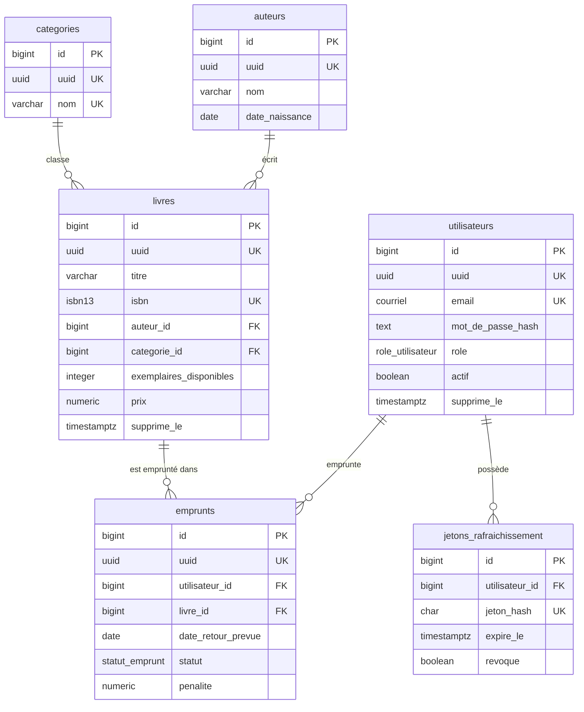

# DATABASE.md — Le modèle de données PostgreSQL, en détail

Ce document décrit **exhaustivement** la base `bibliotheque` : ses extensions, ses types  
personnalisés, ses tables et contraintes, ses index, ses relations, ses vues (dont une **vue  
matérialisée**), ses fonctions et procédures **PL/pgSQL**, ses triggers, ses tâches **`pg_cron`**,  
sa gestion des transactions et des erreurs SQL. Chaque élément est **expliqué et justifié**.

> **Parité avec le dépôt jumeau MariaDB.** Le modèle logique (tables, relations, règles métier) et  
> les données de démonstration sont **identiques** à ceux de la version MariaDB. Ce qui change, ce  
> sont les **mécanismes du moteur** : types natifs (`ENUM`, `DOMAIN`, `JSONB`, `NUMERIC`, `uuid`,  
> `timestamptz`), `GENERATED AS IDENTITY`, PL/pgSQL, `pg_cron`, index avancés, codes `SQLSTATE`… La  
> traduction dialecte est synthétisée dans [POSTGRESQL.md](POSTGRESQL.md).

Tout le SQL vit dans `sql/`, découpé par nature et **numéroté** pour garantir l'ordre d'exécution  
au premier démarrage Docker (`/docker-entrypoint-initdb.d/`) :

| Fichier                              | Contenu                                                        |
|--------------------------------------|---------------------------------------------------------------|
| `sql/extensions/00_extensions.sql`   | Extensions `pgcrypto`, `pg_trgm`, `uuid-ossp`                  |
| `sql/schema/01_roles.sql`            | Rôle applicatif + privilèges (moindre privilège)              |
| `sql/schema/02_types.sql`            | Types personnalisés : `ENUM` et `DOMAIN`                      |
| `sql/schema/03_tables.sql`           | Toutes les tables, contraintes et clés étrangères             |
| `sql/schema/04_index.sql`            | Index (B-tree, GIN, BRIN, partiels, couvrants, multicolonnes) |
| `sql/functions/05_fonctions.sql`     | Fonctions PL/pgSQL                                            |
| `sql/views/06_vues.sql`              | Vues + vue **matérialisée**                                   |
| `sql/procedures/07_procedures.sql`   | Procédures PL/pgSQL (paramètres `INOUT`)                      |
| `sql/triggers/08_triggers.sql`       | Fonctions trigger + triggers (`BEFORE`/`AFTER`/`INSTEAD OF`)  |
| `sql/cron/09_cron.sql`               | Extension `pg_cron` + 7 tâches planifiées                     |
| `sql/data/10_seed.sql`               | Jeu de données de démonstration                              |
| `sql/demos/`                         | Scripts pédagogiques autonomes (types, index…)               |
| `sql/migrations/`                    | Exemples de migrations versionnées                           |

**Conventions appliquées partout :**

- Clé primaire technique `id` en `bigint GENERATED ALWAYS AS IDENTITY`, **jamais exposée** à l'API.
- Identifiant public `uuid` (type natif `uuid`), `UNIQUE`, exposé à la place de l'`id` (anti-IDOR),
  généré par `DEFAULT gen_random_uuid()`.
- Horodatage `cree_le` / `modifie_le` en `timestamptz` (stocké en **UTC**). `modifie_le` est
  actualisé par un **trigger** `BEFORE UPDATE` (PostgreSQL n'a pas d'`ON UPDATE CURRENT_TIMESTAMP`).
- Décimaux monétaires en `numeric(8,2)` (précision **exacte**, aucune erreur d'arrondi binaire).
- Suppression **logique** via une colonne `supprime_le` (non NULL ⇒ supprimé) sur `utilisateurs` et
  `livres`.

## Table des matières

- [Diagramme des relations](#diagramme-des-relations)
- [Extensions](#extensions)
- [Types personnalisés (`ENUM`, `DOMAIN`)](#types-personnalisés-enum-domain)
- [Tables](#tables)
- [Index](#index)
- [Vues et vue matérialisée](#vues-et-vue-matérialisée)
- [Fonctions PL/pgSQL](#fonctions-plpgsql)
- [Procédures PL/pgSQL](#procédures-plpgsql)
- [Triggers](#triggers)
- [Tâches planifiées (`pg_cron`)](#tâches-planifiées-pg_cron)
- [Transactions](#transactions)
- [Gestion des erreurs SQL](#gestion-des-erreurs-sql)
- [Privilèges et sécurité](#privilèges-et-sécurité)

---

## Diagramme des relations

### Vue Mermaid (rendu automatique sur GitHub/GitLab)



Trois tables **techniques** ne portent pas de relation directe et sont alimentées par les triggers  
ou `pg_cron` : `journal_audit` (audit JSONB), `emprunts_archive` (archivage), et
`statistiques_quotidiennes` (agrégats).

### Vue ASCII

```
   auteurs 1 ────< livres >──── 1 categories
                     │
   utilisateurs 1 ──< emprunts >── 1 livres
   utilisateurs 1 ──< jetons_rafraichissement

   (tables alimentées automatiquement :
     journal_audit ← triggers  ·  emprunts_archive ← pg_cron  ·  statistiques_quotidiennes ← pg_cron)
```

**Politiques de suppression des clés étrangères :**

| Relation                                   | `ON DELETE` | Raison |
|--------------------------------------------|-------------|--------|
| `livres.auteur_id` → `auteurs.id`          | `RESTRICT`  | Interdit de supprimer un auteur encore référencé (pas de livre orphelin) |
| `livres.categorie_id` → `categories.id`    | `RESTRICT`  | Idem pour les catégories |
| `emprunts.utilisateur_id` → `utilisateurs.id` | `CASCADE` | Supprimer un utilisateur supprime ses emprunts |
| `emprunts.livre_id` → `livres.id`          | `RESTRICT`  | Interdit de supprimer un livre historiquement emprunté |
| `jetons_rafraichissement.utilisateur_id`   | `CASCADE`   | Les jetons suivent le compte |

Toutes les FK sont aussi `ON UPDATE CASCADE`.

---

## Extensions

Activées dans `sql/extensions/00_extensions.sql` (sauf `pg_cron`, préchargée séparément — voir
[Tâches planifiées](#tâches-planifiées-pg_cron)) :

| Extension    | Rôle dans le projet |
|--------------|---------------------|
| `pgcrypto`   | `gen_random_uuid()` pour les identifiants publics non devinables |
| `pg_trgm`    | Index GIN trigram accélérant `titre ILIKE '%…%'` (recherche floue) |
| `uuid-ossp`  | Génération d'UUID (pédagogique / compatibilité) |
| `pg_cron`    | Ordonnanceur de tâches SQL (7 tâches de maintenance) |

Le détail « intérêt / fonctionnement / usage » de chaque extension est dans
[POSTGRESQL.md](POSTGRESQL.md#extensions).

---

## Types personnalisés (`ENUM`, `DOMAIN`)

PostgreSQL permet de définir ses **propres types** (`sql/schema/02_types.sql`), gage de lisibilité  
et d'intégrité — un atout face à MariaDB.

### `ENUM` — listes fermées et ordonnées

```sql
CREATE TYPE role_utilisateur AS ENUM ('admin', 'bibliothecaire', 'membre');
CREATE TYPE statut_emprunt   AS ENUM ('en_cours', 'rendu', 'en_retard');
CREATE TYPE operation_audit  AS ENUM ('INSERT', 'UPDATE', 'DELETE');
```

L'ordre de déclaration définit l'ordre de tri du type. Contrairement à l'`ENUM` **inline** de  
MariaDB (attaché à une colonne), c'est ici un **vrai type réutilisable** partout.

### `DOMAIN` — un type de base + une contrainte `CHECK`

```sql
CREATE DOMAIN courriel AS text
    CHECK (VALUE ~* '^[^@[:space:]]+@[^@[:space:]]+\.[^@[:space:]]+$');

CREATE DOMAIN isbn13 AS text
    CHECK (VALUE ~ '^[0-9]{13}$');
```

La règle est définie **une seule fois** et s'applique automatiquement à **toute colonne** de ce  
type. Impossible d'insérer un e-mail malformé ou un ISBN non canonique : c'est une **défense en  
profondeur** côté base, qui complète la validation applicative (côté Go). MariaDB n'a pas  
d'équivalent aussi élégant.

---

## Tables

Neuf tables au total. Types **natifs** notables : `uuid`, `timestamptz`, `numeric`, les `ENUM`/
`DOMAIN` ci-dessus, et `jsonb`.

### `utilisateurs`

Comptes applicatifs (authentification, rôles, suppression logique).

| Colonne             | Type               | Contraintes / notes |
|---------------------|--------------------|---------------------|
| `id`                | `bigint`           | PK, `GENERATED ALWAYS AS IDENTITY` |
| `uuid`              | `uuid`             | `UNIQUE`, `DEFAULT gen_random_uuid()` |
| `email`             | `courriel`         | `UNIQUE`, `NOT NULL` (DOMAIN validé par regex) |
| `mot_de_passe_hash` | `text`             | `NOT NULL` — haché **bcrypt** (jamais en clair) |
| `nom`, `prenom`     | `varchar(100)`     | `NOT NULL` |
| `role`              | `role_utilisateur` | `NOT NULL`, `DEFAULT 'membre'` |
| `actif`             | `boolean`          | `NOT NULL`, `DEFAULT true` |
| `cree_le`, `modifie_le` | `timestamptz`  | `NOT NULL`, `DEFAULT now()` |
| `supprime_le`       | `timestamptz`      | NULL = actif ; non NULL = supprimé logiquement |

### `categories`

| Colonne       | Type            | Contraintes |
|---------------|-----------------|-------------|
| `id`          | `bigint`        | PK identity |
| `uuid`        | `uuid`          | `UNIQUE`, défaut aléatoire |
| `nom`         | `varchar(100)`  | `UNIQUE`, `NOT NULL` |
| `description` | `varchar(500)`  | `NOT NULL`, `DEFAULT ''` |
| `cree_le`, `modifie_le` | `timestamptz` | `DEFAULT now()` |

### `auteurs`

| Colonne          | Type            | Contraintes |
|------------------|-----------------|-------------|
| `id`             | `bigint`        | PK identity |
| `uuid`           | `uuid`          | `UNIQUE` |
| `nom`            | `varchar(100)`  | `NOT NULL` |
| `prenom`, `nationalite` | `varchar(100)` | `NOT NULL`, `DEFAULT ''` |
| `date_naissance` | `date`          | nullable |
| `biographie`     | `text`          | nullable |
| `cree_le`, `modifie_le` | `timestamptz` | `DEFAULT now()` |

### `livres`

Catalogue et gestion du stock. Porte deux clés étrangères et les invariants métier.

| Colonne                   | Type            | Contraintes / notes |
|---------------------------|-----------------|---------------------|
| `id`                      | `bigint`        | PK identity |
| `uuid`                    | `uuid`          | `UNIQUE` |
| `titre`                   | `varchar(255)`  | `NOT NULL` |
| `isbn`                    | `isbn13`        | `UNIQUE`, `NOT NULL` (DOMAIN 13 chiffres) |
| `auteur_id`               | `bigint`        | FK → `auteurs(id)` `ON DELETE RESTRICT` |
| `categorie_id`            | `bigint`        | FK → `categories(id)` `ON DELETE RESTRICT` |
| `annee_publication`       | `smallint`      | `NOT NULL` |
| `nombre_exemplaires`      | `integer`       | `NOT NULL`, `DEFAULT 1` |
| `exemplaires_disponibles` | `integer`       | `NOT NULL`, `DEFAULT 1` |
| `resume`                  | `text`          | nullable |
| `prix`                    | `numeric(8,2)`  | `NOT NULL`, `DEFAULT 0` (monnaie exacte) |
| `langue`                  | `varchar(50)`   | `NOT NULL`, `DEFAULT 'français'` |
| `cree_le`, `modifie_le`   | `timestamptz`   | `DEFAULT now()` |
| `supprime_le`             | `timestamptz`   | suppression logique |

**Contraintes `CHECK` (invariants garantis par la base) :**

- `chk_livres_stock` : `exemplaires_disponibles <= nombre_exemplaires`
- `chk_livres_stock_positif` : `exemplaires_disponibles >= 0 AND nombre_exemplaires >= 0`
- `chk_livres_annee` : `annee_publication BETWEEN 1400 AND 2200`
- `chk_livres_prix` : `prix >= 0`

### `emprunts`

Cœur métier : prêts de livres aux utilisateurs.

| Colonne                 | Type             | Contraintes / notes |
|-------------------------|------------------|---------------------|
| `id`                    | `bigint`         | PK identity |
| `uuid`                  | `uuid`           | `UNIQUE` |
| `utilisateur_id`        | `bigint`         | FK → `utilisateurs(id)` `ON DELETE CASCADE` |
| `livre_id`              | `bigint`         | FK → `livres(id)` `ON DELETE RESTRICT` |
| `date_emprunt`          | `date`           | `NOT NULL`, `DEFAULT CURRENT_DATE` |
| `date_retour_prevue`    | `date`           | **nullable à dessein** : calculée par trigger si absente (+14 j) |
| `date_retour_effective` | `date`           | renseignée au retour |
| `statut`                | `statut_emprunt` | `NOT NULL`, `DEFAULT 'en_cours'` |
| `penalite`              | `numeric(8,2)`   | `NOT NULL`, `DEFAULT 0` |
| `cree_le`, `modifie_le` | `timestamptz`    | `DEFAULT now()` |

**Contraintes `CHECK` :** `penalite >= 0` ; `date_retour_prevue IS NULL OR date_retour_prevue >= date_emprunt`.

### `jetons_rafraichissement`

Refresh tokens **hachés** (SHA-256) pour renouveler les JWT.

| Colonne          | Type          | Contraintes |
|------------------|---------------|-------------|
| `id`             | `bigint`      | PK identity |
| `utilisateur_id` | `bigint`      | FK → `utilisateurs(id)` `ON DELETE CASCADE` |
| `jeton_hash`     | `char(64)`    | `UNIQUE`, `NOT NULL` (SHA-256 hexadécimal) |
| `expire_le`      | `timestamptz` | `NOT NULL` |
| `revoque`        | `boolean`     | `NOT NULL`, `DEFAULT false` |
| `cree_le`        | `timestamptz` | `DEFAULT now()` |

### `journal_audit`

Journal d'audit alimenté **uniquement** par des triggers. Illustre **`JSONB`**.

| Colonne              | Type              | Notes |
|----------------------|-------------------|-------|
| `id`                 | `bigint`          | PK identity |
| `table_concernee`    | `varchar(64)`     | `NOT NULL` |
| `operation`          | `operation_audit` | `NOT NULL` (ENUM `INSERT`/`UPDATE`/`DELETE`) |
| `cle_enregistrement` | `bigint`          | id de la ligne concernée |
| `anciennes_valeurs`  | `jsonb`           | photo **avant** (indexable GIN) |
| `nouvelles_valeurs`  | `jsonb`           | photo **après** (indexable GIN) |
| `acteur_sql`         | `varchar(128)`    | `DEFAULT current_user` |
| `cree_le`            | `timestamptz`     | `DEFAULT now()` |

### `emprunts_archive`

Reçoit les emprunts anciens (déplacés par `pg_cron`). Mêmes colonnes que `emprunts` (le `statut` y  
est stocké en `varchar(20)`), plus `archive_le timestamptz DEFAULT now()`. La PK `id` **n'est pas**  
identity (on réinjecte l'`id` d'origine).

### `statistiques_quotidiennes`

Instantané journalier calculé par `pg_cron`.

| Colonne | Type | Notes |
|---------|------|-------|
| `id` | `bigint` | PK identity |
| `date_statistique` | `date` | `UNIQUE` (`uq_stats_date`) — support de l'UPSERT |
| `nb_emprunts_actifs`, `nb_emprunts_en_retard`, `nb_livres`, `nb_exemplaires_dispo`, `nb_utilisateurs_actifs` | `integer` | compteurs, `DEFAULT 0` |
| `cree_le` | `timestamptz` | `DEFAULT now()` |

---

## Index

Là où MariaDB propose surtout des index B-tree (et `FULLTEXT`), PostgreSQL offre une **palette**  
riche. `sql/schema/04_index.sql` illustre concrètement chaque méthode :

| Index | Table | Méthode | Intérêt |
|-------|-------|---------|---------|
| `idx_utilisateurs_role` | `utilisateurs` | B-tree | Filtrer par rôle |
| `idx_utilisateurs_actifs` | `utilisateurs` | B-tree **partiel** `WHERE supprime_le IS NULL` | Plus petit/rapide : n'indexe que les comptes actifs |
| `idx_auteurs_nom_prenom` | `auteurs` | B-tree **multicolonne** `(nom, prenom)` | Tris/filtres par nom complet |
| `idx_auteurs_nom_trgm` | `auteurs` | **GIN + `gin_trgm_ops`** | `nom ILIKE '%…%'` (recherche floue) |
| `idx_livres_auteur`, `idx_livres_categorie` | `livres` | B-tree | Jointures / filtres sur les FK |
| `idx_livres_titre_trgm` | `livres` | **GIN + trigrammes** | Rend rapide `titre ILIKE '%terme%'` exposé par l'API |
| `idx_livres_categorie_couvrant` | `livres` | B-tree **couvrant** `INCLUDE (titre, prix)` **partiel** | *Index-only scan* pour lister une catégorie |
| `idx_emprunts_utilisateur`, `idx_emprunts_livre` | `emprunts` | B-tree | FK |
| `idx_emprunts_util_statut` | `emprunts` | B-tree **multicolonne** `(utilisateur_id, statut)` | « emprunts d'un membre par statut » |
| `idx_emprunts_actifs` | `emprunts` | B-tree **partiel** `WHERE statut IN ('en_cours','en_retard')` | Détection des retards |
| `idx_audit_nouvelles_gin` | `journal_audit` | **GIN sur `jsonb`** | Recherche *dans* le document : `nouvelles_valeurs @> '{"role":"admin"}'` |
| `idx_audit_cree_le_brin` | `journal_audit` | **BRIN** sur `cree_le` | Index **minuscule** pour table append-only (corrélée au temps) |
| `idx_audit_table` | `journal_audit` | B-tree | Filtrer par table auditée |
| `idx_jetons_utilisateur`, `idx_jetons_expire` | `jetons_rafraichissement` | B-tree | Recherche / purge |
| `idx_vue_stats_livres_id` | vue matérialisée | B-tree **UNIQUE** | Requis pour `REFRESH … CONCURRENTLY` |

**À retenir :** un index accélère les **lectures** mais coûte en écriture et en espace. On vérifie
son usage réel avec `EXPLAIN (ANALYZE) …` (voir [POSTGRESQL.md](POSTGRESQL.md#explain-et-explain-analyze)).  
Les méthodes Hash et GiST, moins utiles ici, sont illustrées dans `sql/demos/`.

---

## Vues et vue matérialisée

Fichier `sql/views/06_vues.sql`. Une **vue** est recalculée à chaque interrogation ; une **vue  
matérialisée** stocke physiquement son résultat (lecture instantanée, mais à **rafraîchir**).

| Objet | Type | Rôle |
|-------|------|------|
| `vue_livres_details` | vue | Catalogue « prêt à afficher » : jointures auteur + catégorie, disponibilité (`fn_est_disponible`), `prix::float8`. **C'est la vue lue par le repository livres.** |
| `vue_emprunts_en_cours` | vue | Emprunts non rendus, avec noms d'utilisateur et titres |
| `vue_emprunts_en_retard` | vue | Emprunts en retard, avec `jours_de_retard` et `penalite_courante` (calculée) |
| `vue_statistiques_livres` | **vue matérialisée** | Popularité des livres |
| `vue_livres_actifs` | vue | Support de la démo `INSTEAD OF` (voir Triggers) |

La vue matérialisée combine trois démonstrations avancées :

```sql
CREATE MATERIALIZED VIEW vue_statistiques_livres AS
SELECT
    l.id, l.uuid, l.titre,
    count(e.id)                                                      AS nombre_emprunts_total,
    count(e.id) FILTER (WHERE e.statut IN ('en_cours','en_retard')) AS nombre_emprunts_actifs,  -- agrégat conditionnel
    rank() OVER (ORDER BY count(e.id) DESC)                         AS rang_popularite           -- fonction fenêtre
FROM livres l
    LEFT JOIN emprunts e ON e.livre_id = l.id
WHERE l.supprime_le IS NULL
GROUP BY l.id, l.uuid, l.titre
WITH DATA;

CREATE UNIQUE INDEX idx_vue_stats_livres_id ON vue_statistiques_livres (id);  -- requis pour CONCURRENTLY
```

Elle est rafraîchie chaque jour par `pg_cron` (`bib_refresh_stats`) via
`REFRESH MATERIALIZED VIEW CONCURRENTLY` (sans bloquer les lectures, grâce à l'index unique).

---

## Fonctions PL/pgSQL

Fichier `sql/functions/05_fonctions.sql`. Le corps est délimité par **dollar-quoting** (`$$ … $$`),  
sans `DELIMITER`. Le mot-clé de **volatilité** (`STABLE`, `IMMUTABLE`, `VOLATILE`) aide l'optimiseur.

| Signature | Retour | Volatilité | Rôle |
|-----------|--------|-----------|------|
| `fn_est_disponible(p_livre_id bigint)` | `boolean` | `STABLE` | Le livre a-t-il ≥ 1 exemplaire disponible ? (`COALESCE` → FALSE si inexistant) |
| `fn_calculer_penalite(p_date_prevue date, p_date_effective date)` | `numeric` | `STABLE` | Pénalité de retard : **0,50 € / jour** entamé ; `GREATEST(..., 0)` (pas de bonus en avance) |
| `fn_nb_emprunts_actifs(p_utilisateur_id bigint)` | `integer` | `STABLE` | Nombre d'emprunts `en_cours`/`en_retard` d'un membre (support du quota) |

> Astuce PostgreSQL exploitée : la **soustraction de deux `date`** renvoie directement un entier  
> (nombre de jours), plus simple que `DATEDIFF`.

Ces fonctions sont réutilisées par les vues (`vue_livres_details`, `vue_emprunts_en_retard`), la  
procédure d'emprunt et la transaction de retour — la règle est écrite **une fois**.

---

## Procédures PL/pgSQL

Fichier `sql/procedures/07_procedures.sql`. Une **procédure** s'appelle avec `CALL`, peut renvoyer  
plusieurs valeurs via des paramètres **`INOUT`**, et bénéficie de l'atomicité du bloc
`BEGIN … EXCEPTION` (chaque bloc crée un **savepoint implicite** : une exception annule les
modifications du bloc).

### `pr_emprunter_livre` — emprunt atomique et sûr

```sql
CREATE OR REPLACE PROCEDURE pr_emprunter_livre(
    p_utilisateur_uuid uuid,
    p_livre_uuid       uuid,
    p_duree_jours      integer,
    INOUT p_emprunt_uuid  uuid,
    INOUT p_code_resultat integer,
    INOUT p_message       text
) LANGUAGE plpgsql AS $$ … $$;
```

Logique : normalise la durée (1–90 j, défaut 14) ; vérifie l'utilisateur (actif) ; **verrouille le  
livre** (`SELECT … FOR UPDATE`, sérialise les emprunts concurrents du dernier exemplaire) ; vérifie  
la disponibilité et le **quota** (5 emprunts simultanés max) ; crée l'emprunt (date de retour via
`INTERVAL`) et **décrémente** le stock. Un bloc `EXCEPTION WHEN OTHERS` sert de filet de sécurité.

**Codes de retour (`p_code_resultat`) — identiques à la version MariaDB (parité stricte) :**

| Code | Signification | Traduction HTTP côté Go |
|:----:|---------------|-------------------------|
| `0` | Succès (emprunt créé, `p_emprunt_uuid` renseigné) | `201 Created` |
| `1` | Livre introuvable | `404 Not Found` |
| `2` | Utilisateur introuvable ou inactif | `404 Not Found` |
| `3` | Aucun exemplaire disponible | `409 Conflict` |
| `4` | Quota d'emprunts simultanés atteint | `409 Conflict` |
| `99` | Erreur inattendue (bloc `EXCEPTION`) | `500 Internal` |

Appel depuis Go (repository), **sans** connexion dédiée ni variables de session (à la différence de  
MariaDB) :

```go
r.db.QueryRowContext(ctx,
    "CALL pr_emprunter_livre($1, $2, $3, NULL, NULL, NULL)",
    utilisateurUUID, livreUUID, dureeJours).Scan(&empruntUUID, &code, &message)
```

### `pr_statistiques_utilisateur`

Renvoie **quatre** indicateurs via des `INOUT` (`p_nb_total`, `p_nb_en_cours`, `p_nb_en_retard`,
`p_total_penalites`), avec `count(*) FILTER (WHERE …)`. Appelée par
`CALL pr_statistiques_utilisateur($1, NULL, NULL, NULL, NULL)`.

### `pr_ajuster_disponibilite`

Exemple minimal de paramètre `INOUT` « pur » : borne un stock à zéro (`GREATEST(p_disponibles + p_delta, 0)`).

---

## Triggers

Fichier `sql/triggers/08_triggers.sql`. **Modèle PostgreSQL** : on sépare une **fonction trigger**
(`RETURNS trigger`, qui contient la logique) du **`CREATE TRIGGER`** (qui l'attache à une table, un
moment et un événement). Avantage : une même fonction est **réutilisée** par plusieurs triggers.  
Variables spéciales : `NEW`/`OLD`, `TG_OP`, `TG_TABLE_NAME`. `RAISE EXCEPTION` **annule** l'opération
(équivalent du `SIGNAL` de MariaDB), capté côté Go en `409`.

### Fonctions trigger génériques

| Fonction | Rôle |
|----------|------|
| `fn_maj_modifie_le()` | Met `NEW.modifie_le := now()` (reproduit l'`ON UPDATE CURRENT_TIMESTAMP` absent de PostgreSQL) |
| `fn_audit()` | Journalise toute opération dans `journal_audit` en **JSONB** (`to_jsonb(NEW) - 'mot_de_passe_hash'` retire le hash). Une seule fonction pour plusieurs tables |
| `fn_utilisateurs_normaliser()` | E-mail en minuscules + `trim` |
| `fn_livres_normaliser()` | Retire tirets/espaces de l'ISBN (avant validation du DOMAIN) |
| `fn_livres_valider_stock()` | `RAISE EXCEPTION` si `exemplaires_disponibles > nombre_exemplaires` |
| `fn_emprunts_date_retour()` | Calcule `date_retour_prevue` = `date_emprunt + 14 jours` si absente |
| `fn_emprunts_interdire_suppr_active()` | `RAISE EXCEPTION` si on supprime un emprunt encore actif |
| `fn_livres_actifs_instead_delete()` | Transforme un `DELETE` sur une vue en **soft delete** |

### Triggers attachés

| Trigger | Table | Timing / événement | Fonction |
|---------|-------|--------------------|----------|
| `trg_utilisateurs_normaliser` | `utilisateurs` | `BEFORE INSERT OR UPDATE` | `fn_utilisateurs_normaliser` |
| `trg_utilisateurs_modifie` | `utilisateurs` | `BEFORE UPDATE` | `fn_maj_modifie_le` |
| `trg_utilisateurs_audit` | `utilisateurs` | `AFTER INSERT OR UPDATE OR DELETE` | `fn_audit` |
| `trg_livres_normaliser` | `livres` | `BEFORE INSERT OR UPDATE` | `fn_livres_normaliser` |
| `trg_livres_valider_stock` | `livres` | `BEFORE UPDATE` | `fn_livres_valider_stock` |
| `trg_livres_modifie` | `livres` | `BEFORE UPDATE` | `fn_maj_modifie_le` |
| `trg_livres_audit` | `livres` | `AFTER UPDATE` | `fn_audit` |
| `trg_emprunts_date_retour` | `emprunts` | `BEFORE INSERT` | `fn_emprunts_date_retour` |
| `trg_emprunts_modifie` | `emprunts` | `BEFORE UPDATE` | `fn_maj_modifie_le` |
| `trg_emprunts_audit` | `emprunts` | `AFTER INSERT OR UPDATE` | `fn_audit` |
| `trg_emprunts_interdire_suppr` | `emprunts` | `BEFORE DELETE` | `fn_emprunts_interdire_suppr_active` |
| `trg_categories_modifie` | `categories` | `BEFORE UPDATE` | `fn_maj_modifie_le` |
| `trg_auteurs_modifie` | `auteurs` | `BEFORE UPDATE` | `fn_maj_modifie_le` |
| `trg_livres_actifs_instead_delete` | `vue_livres_actifs` | **`INSTEAD OF DELETE`** | `fn_livres_actifs_instead_delete` |

> **`INSTEAD OF`** (propre à PostgreSQL) rend une **vue modifiable** : supprimer une ligne de  
> `vue_livres_actifs` déclenche en réalité un *soft delete* (`UPDATE livres SET supprime_le = now()`).  
> C'est une démonstration pédagogique (la vue n'est pas utilisée par l'API).

Un trigger `BEFORE` renvoie `NEW` (éventuellement modifié) ; un trigger `AFTER` renvoie `NULL`
(valeur ignorée).

---

## Tâches planifiées (`pg_cron`)

Fichier `sql/cron/09_cron.sql`. PostgreSQL n'a **pas** d'ordonnanceur intégré (contrairement à  
l'Event Scheduler de MariaDB) : on utilise l'extension **`pg_cron`**, qui exécute du SQL selon une  
planification cron **dans la base**. Elle doit être **préchargée** au démarrage
(`shared_preload_libraries=pg_cron`, `cron.database_name=bibliotheque`) — assuré par le `command:`
du `docker-compose.yml` et l'image `docker/postgres/Dockerfile`.

Deux fonctions de maintenance portent la logique multi-instructions :

- `fn_archiver_emprunts_anciens()` : déplace les emprunts rendus depuis > 1 an vers
  `emprunts_archive`. Démontre une **CTE qui modifie les données** (`WITH … DELETE … RETURNING`)
  combinée à un `INSERT`.
- `fn_calculer_statistiques_quotidiennes()` : agrège les indicateurs du jour avec un **UPSERT**
  (`INSERT … ON CONFLICT (date_statistique) DO UPDATE SET … EXCLUDED.…`).

### Les 7 tâches

| # | Nom | Planification (`m h j M jsem`) | Action |
|:-:|-----|-------------------------------|--------|
| 1 | `bib_marquer_retards` | `0 1 * * *` (01h00) | `UPDATE emprunts SET statut = 'en_retard'` pour les prêts échus encore `en_cours` |
| 2 | `bib_purger_jetons` | `0 * * * *` (chaque heure) | `DELETE` des jetons expirés ou révoqués |
| 3 | `bib_archiver` | `30 2 * * *` (02h30) | `SELECT fn_archiver_emprunts_anciens()` |
| 4 | `bib_statistiques` | `0 3 * * *` (03h00) | `SELECT fn_calculer_statistiques_quotidiennes()` |
| 5 | `bib_refresh_stats` | `15 3 * * *` (03h15) | `REFRESH MATERIALIZED VIEW CONCURRENTLY vue_statistiques_livres` |
| 6 | `bib_nettoyer_audit` | `0 4 * * 0` (dimanche 04h00) | `DELETE` du `journal_audit` de plus de 90 jours |
| 7 | `bib_maintenance` | `0 5 * * 0` (dimanche 05h00) | `VACUUM ANALYZE` (récupère l'espace des lignes mortes + actualise les stats) |

Inspection :

```sql
SELECT jobid, jobname, schedule, active FROM cron.job ORDER BY jobid;
SELECT * FROM cron.job_run_details ORDER BY start_time DESC;  -- historique
SELECT cron.unschedule('bib_maintenance');                    -- supprimer une tâche
```

> **Message bénin au 1er démarrage.** `pg_cron` tente de se connecter pendant l'amorçage, avant la  
> création de la base : un `FATAL: database "bibliotheque" does not exist` peut apparaître **une  
> fois** dans les logs. Sans conséquence — il se reconnecte ensuite.

La comparaison Event Scheduler / `pg_cron` / cron Linux / Kubernetes CronJob (quand préférer quoi)  
est dans [POSTGRESQL.md](POSTGRESQL.md#planifier-des-tâches--event-scheduler-pg_cron-cron-linux-kubernetes).

---

## Transactions

Le projet illustre les transactions de **deux façons complémentaires**, avec dans les deux cas un  
verrou `FOR UPDATE` pour sérialiser l'accès concurrent au stock.

### 1. Dans une procédure (côté base) — l'emprunt

`pr_emprunter_livre` est **atomique** par construction : la création de l'emprunt et le décrément
du stock se font dans un même bloc PL/pgSQL. En cas d'erreur, le savepoint implicite du bloc
`EXCEPTION` annule les modifications. Aucun `START TRANSACTION`/`COMMIT` explicite (incompatible
avec un `CALL` en autocommit).

### 2. Dans le code Go — le retour

`EmpruntRepository.Rendre` utilise le helper `database.EnTransaction` (`internal/database/transaction.go`),
qui gère `COMMIT`/`ROLLBACK` automatiquement (y compris sur `panic`) :

```go
err := database.EnTransaction(ctx, r.db, func(tx *sql.Tx) error {
    // 1) verrou + lecture de l'état courant
    //    SELECT id, livre_id, statut::text, date_retour_prevue FROM emprunts WHERE uuid = $1 FOR UPDATE
    // 2) refuser un emprunt déjà rendu
    // 3) pénalité = fn_calculer_penalite($1, CURRENT_DATE)
    // 4) UPDATE emprunts SET statut='rendu', date_retour_effective=CURRENT_DATE, penalite=$1
    // 5) UPDATE livres SET exemplaires_disponibles = exemplaires_disponibles + 1
    return nil // -> COMMIT ; toute erreur -> ROLLBACK
})
```

> Les casts `::text` (pour l'ENUM `statut`) et `::float8` (pour le `numeric` `penalite`) facilitent  
> le `Scan` côté Go. Détails pool/pgx : [docs/PERFORMANCES.md](docs/PERFORMANCES.md).

---

## Gestion des erreurs SQL

PostgreSQL utilise des codes **`SQLSTATE`** normalisés de 5 caractères (là où MySQL/MariaDB utilise  
des codes numériques comme `1062`). Le paquet `internal/database/erreurs.go` les traduit en concepts  
métier, pour renvoyer une `*apperreur.Erreur` claire **sans fuite technique** :

| `SQLSTATE` | Nom | Cause | Réponse API |
|-----------|-----|-------|-------------|
| `23505` | `unique_violation` | Doublon sur contrainte `UNIQUE` (e-mail, ISBN…) | `409 Conflit` avec message adapté |
| `23503` | `foreign_key_violation` | `INSERT`/`UPDATE` référençant un parent inexistant | `409 Conflit` |
| `23001` | `restrict_violation` | `DELETE` bloqué par une FK `ON DELETE RESTRICT` | `409 Conflit` |
| `23514` | `check_violation` | Violation d'une contrainte `CHECK` | traité comme erreur de cohérence |
| `P0001` | `raise_exception` | `RAISE EXCEPTION` d'un trigger/procédure | `409 Conflit`, **message métier exposé tel quel** |

> **Piège PostgreSQL documenté dans le code :** une suppression bloquée par `ON DELETE RESTRICT`  
> lève `restrict_violation` (`23001`), un code **distinct** de `foreign_key_violation` (`23503`) —  
> `EstErreurCleEtrangere` teste donc **les deux**. (MySQL, lui, utilise `1451`/`1452`.)

Les messages des `RAISE EXCEPTION` (SQLSTATE `P0001`) sont **rédigés en français** et pensés pour  
l'utilisateur : `MessageSignal` les extrait pour les exposer directement (à la différence des autres  
erreurs SQL, toujours masquées derrière un message générique).

---

## Privilèges et sécurité

Le rôle applicatif `app_bibliotheque` (attribut `LOGIN`, **non superutilisateur**) est créé au
**moindre privilège** dans `sql/schema/01_roles.sql` : `CONNECT` + `USAGE` sur `public` + CRUD via
`ALTER DEFAULT PRIVILEGES`, **sans** `DROP`/`ALTER`/`TRUNCATE` ni `CREATE` sur `public`
(`REVOKE … FROM PUBLIC`). Un `statement_timeout = 30s` est appliqué au rôle. Même en cas
d'injection SQL, l'attaquant ne peut pas détruire le schéma.

Le détail (modèle de rôles PostgreSQL, `ALTER DEFAULT PRIVILEGES`, connexion `sslmode`) est dans
[POSTGRESQL.md](POSTGRESQL.md#rôles-et-privilèges) et [docs/SECURITE.md](docs/SECURITE.md).
